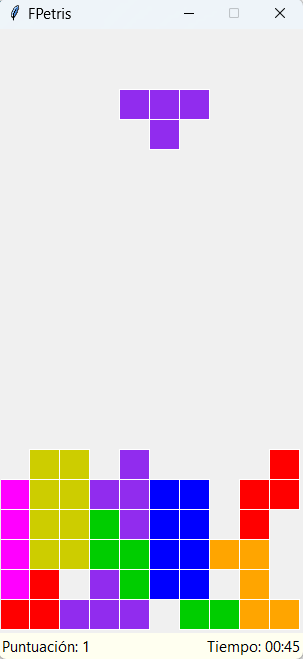
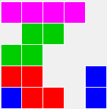

# Juego "FPetris"

## Contexto
Se ha diseñado un juego FPetris, y ya se dispone de la implementación de su interfaz gráfica en el módulo ``src/fpetris/gui.py``. Sin embargo, aún faltan por implementar algunas funciones encargadas de parte de la lógica de funcionamiento del juego. Estas funciones están especificadas en el módulo ``src/fpetris/utiles.py``.

El objetivo del juego es hacer caer las piezas de manera que vayan encajando y formando líneas horizontales completas. Para ello, podemos mover las piezas a izquierda o derecha mediante el cursor del teclado, hacerlas girar mediante la tecla arriba, o hacerlas caer más rápido mediante la tecla abajo. 
 



### Representación del tablero de juego

El tablero de juego está representado por una matriz de posiciones ``(x, y)`` (o lo que es lo mismo, ``(columna, fila)``), de manera que la posición de la esquina superior izquierda sería la ``(0, 0)``. Cada posición del tablero es una celda que puede estar en blanco (lo representamos el valor ``None``), o bien puede estar ocupada (lo representaremos mediante una cadena que indica el color). 

Por ejemplo, este tablero:



quedaría representado por:

```python
[
    ["pink", "pink", "pink", "pink", None],
    [None, "green", "green", None, None],
    ["green", "green", None, None, None],
    ["red", "red", None, None, "blue"],
    ["blue", "red", "red", None, "blue"]
]
```

Observa que se trata de una lista de filas, siendo cada fila a su vez una lista de celdas (una por columna del tablero).

### Representación de las piezas

Las piezas del juego están representadas por una matriz de valores lógicos, indicando cada valor si la pieza tiene o no una celda en esa 
posición. Se muestran a continuación las matrices de cada una de las piezas que se usan en el juego, junto a una representación en texto de la forma de dicha pieza (las celdas se representan mediante ``█`` y los espacios vacíos mediante ``.``):

``` python
'''
████
'''
[[True, True, True, True]]    

'''
███
.█.
'''
[[True, True, True], [False, True, False]]    

'''
.██
██.
'''
[[False, True, True], [True, True, False]]    

'''
██.
.██
'''
[[True, True, False], [False, True, True]]   

'''
██
██
'''
[[True, True], [True, True]]    

'''
███
█..
'''
[[True, True, True], [True, False, False]]    

'''
███
..█
'''
[[True, True, True], [False, False, True]]    

```

### Rotación de las piezas

El usuario puede rotar las piezas. Para rotar 90 grados una pieza, debemos seguir una serie de pasos. Imaginemos que la pieza a rotar es esta:
```python
'''
███
█..
'''
[[True, True, True], [True, False, False]] 
```

Primero, invertiremos el orden de las filas:
```python
'''
█..
███
'''
[[True, False, False], [True, True, True]] 
```

Y ahora, debemos trasporner la matriz. Observa que pasamos de una matriz de dos filas con tres celdas o columnas cada una, a una matriz con tres filas con dos celdas o columnas cada una:
```python
'''
██
.█
.█
'''
[[True, True], [False, True], [False, True]]
```

## Objetivo

**Implemente** las funciones del módulo ``src/fpetris/utiles.py``. Para cada función, se proporciona un comentario de documentación que indica claramente qué debe realizar la función, qué parámetros recibe y qué devuelve. También se incluyen ejemplos de casos de prueba, que puede utilizar para probar la función de manera interactiva y que ayudan a entender lo que se supone que debe hacer la función.

Una vez considere que una función está correctamente implementada, ejecute el módulo ``src/fpetris/utiles_test.py``, el cual probará exhaustivamente las implementaciones y le informará de si todas las pruebas son superadas con éxito. Si no supera alguno de los tests, **depure** su implementación con ayuda del depurador de Visual Studio Code. 

Una vez todas las funciones estén correctamente implementadas, debería poder ejecutar el juego mediante el módulo ``src/fpetris/gui.py``, y el juego debería ser completamente funcional.
